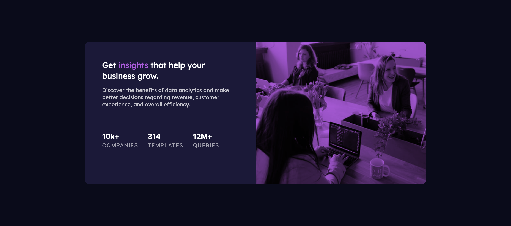

# Frontend Mentor - Stats preview card component solution

This is a solution to the [Stats preview card component challenge on Frontend Mentor](https://www.frontendmentor.io/challenges/stats-preview-card-component-8JqbgoU62). Frontend Mentor challenges help you improve your coding skills by building realistic projects.

## Table of contents

- [Overview](#overview)
  - [The challenge](#the-challenge)
  - [Screenshot](#screenshot)
  - [Links](#links)
- [My process](#my-process)
  - [Built with](#built-with)
  - [What I learned](#what-i-learned)
  - [Continued development](#continued-development)
  - [Useful resources](#useful-resources)
- [Author](#author)
- [Acknowledgments](#acknowledgments)

## Overview

### The challenge

Users should be able to:

- View the optimal layout depending on their device's screen size

### Screenshot

### Links

- Solution URL: [GitHub](https://github.com/Beginneraboutlife116/stats-preview-card-component-main-frontend-mentor)
- Live Site URL: [https://beginneraboutlife116.github.io/stats-preview-card-component-main-frontend-mentor/](https://beginneraboutlife116.github.io/stats-preview-card-component-main-frontend-mentor/)

## My process

### Built with

- Semantic HTML5 markup
- CSS custom properties
- Flexbox
- CSS Grid
- Mobile-first workflow
- CUBE CSS

### What I learned

1. Responsive image

- By using `<picture>` and `<source>` tag, I can switch my header image in different website view.

2. CUBE CSS

- By using CUBE CSS, I can facilitate well in CSS's inheritance ability.

### Useful resources

- [CUBE CSS](https://cube.fyi/)
- [Responsive images](https://developer.mozilla.org/en-US/docs/Learn/HTML/Multimedia_and_embedding/Responsive_images)

## Author

- Website - [Wei Kai](https://github.com/Beginneraboutlife116)
- Frontend Mentor - [@Beginneraboutlife116](https://www.frontendmentor.io/profile/Beginneraboutlife116)
- Twitter - [@WeiKaiLin2](https://twitter.com/WeiKaiLin2)
